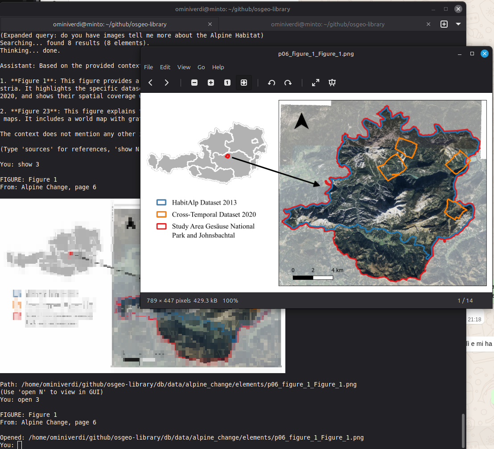
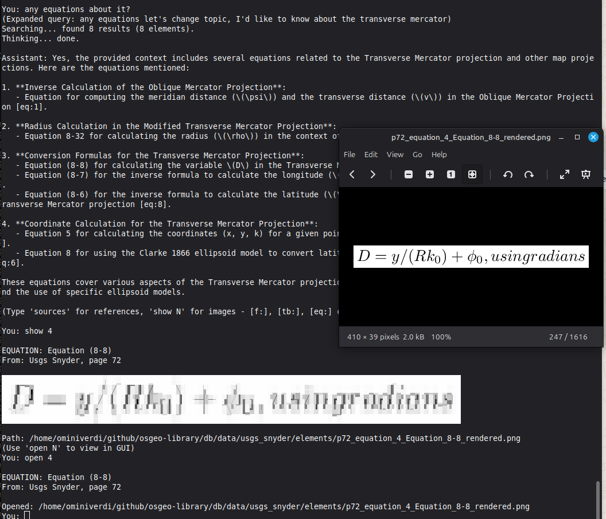

# OSGeo Library

Extract figures, tables, diagrams, and equations from scientific PDFs using vision-language models, then search them with semantic embeddings.



*Semantic search for "Alpine Habitat" with terminal preview (`show`) and GUI viewer (`open`)*

## Overview

This project provides two main capabilities:

1. **Extraction** - Convert PDF pages to images, detect visual elements (figures, tables, equations) with bounding boxes, crop them, and generate structured JSON
2. **Semantic Search** - Store extracted content in PostgreSQL with vector embeddings, then search using natural language via a chat CLI

## Installation

```bash
git clone https://github.com/ominiverdi/osgeo-library.git
cd osgeo-library
python -m venv .venv
source .venv/bin/activate
pip install -r requirements.txt
```

**System dependencies:**

```bash
# Debian/Ubuntu
sudo apt install texlive-latex-base imagemagick chafa

# texlive - LaTeX rendering for equations
# imagemagick - PDF to PNG conversion
# chafa - Terminal image preview (optional)
```

## Extraction

Extract visual elements from PDF pages using a vision-language model.

**Requirements:**
- Vision-language model with OpenAI-compatible API and bounding box support
- We tested with Qwen3-VL-235B via llama.cpp (grounding capability is essential)

**Configure the server** in `extract_document.py`:
```python
LLAMA_SERVER = "http://localhost:8090/v1"
MODEL_NAME = "qwen3-vl-235b"
```

**Extract pages:**
```bash
python extract_document.py paper.pdf --pages 1,2,3,4,5 --output-dir web/data/paper
```

**Output structure:**
```
web/data/paper/
  extraction.json      # Structured data with bounding boxes
  page_01.png          # Page images
  page_01_annotated.png
  elements/
    p01_figure_1_Figure_1.png
    p02_table_1_Table_1.png
    p03_equation_1_Equation_1.png
    p03_equation_1_Equation_1_rendered.png  # LaTeX rendered
```

**View results** in the web viewer:
```bash
cd web && python -m http.server 8000
# Open http://localhost:8000
```

## Semantic Search

Search extracted content using natural language queries.

**Requirements:**
- PostgreSQL with pgvector extension
- Embedding server (we use BGE-M3 via llama.cpp)
- LLM for chat (local or OpenRouter API)

**1. Configure** - copy and edit `config.toml`:
```bash
cp config.example.toml config.toml
```

**2. Initialize database:**
```bash
createdb osgeo_library
psql osgeo_library < db/schema.sql
```

**3. Ingest documents:**
```bash
python ingest_to_db.py web/data/paper
```

**4. Start the chat CLI:**
```bash
python chat_cli.py
```

**CLI commands:**
- `show N` - Preview element in terminal (using chafa)
- `open N` - Open element in GUI viewer
- `sources` - List sources from last answer
- `help` - Show all commands



*Follow-up query for equations with rendered LaTeX preview*

## Configuration

Settings are loaded from `config.toml` (copy from `config.example.toml`).

Key settings:
- **LLM:** Local llama.cpp server or OpenRouter API
- **Embedding:** BGE-M3 server for semantic search
- **Database:** PostgreSQL with pgvector (peer auth supported)
- **Paths:** Data directory for extracted elements

See [ARCHITECTURE.md](docs/ARCHITECTURE.md#configuration) for full details.

## Documentation

- [ARCHITECTURE](docs/ARCHITECTURE.md) - How the pipeline works, configuration
- [EXTRACTIONS](docs/EXTRACTIONS.md) - Catalog of processed documents
- [DECISIONS](docs/DECISIONS.md) - Technical decisions and alternatives
- [CHANGELOG](docs/CHANGELOG.md) - Version history

## Author

Lorenzo Becchi

## License

MIT
