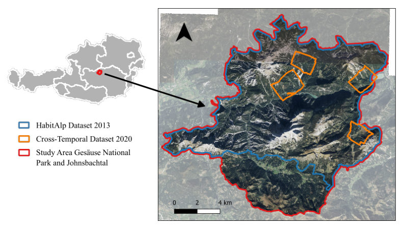
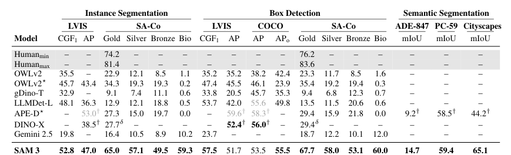

# Technical Decisions

Why we chose X over Y.

---

## Visual Grounding: Qwen3-VL-235B

**Decision:** Use Qwen3-VL-235B for element detection with bounding boxes.

**Alternatives considered:**
| Approach | Result |
|----------|--------|
| PyMuPDF image extraction | Only embedded rasters, fragments composite figures |
| Caption-based heuristics | ~90% accuracy, misses captionless figures |
| Qwen3-VL-8B | Poor bounding boxes (placed Figure 1 at 41% instead of 72%) |
| Qwen3-VL-32B | Good for figures/tables, weaker on equations |
| **Qwen3-VL-235B** | **Excellent accuracy, best LaTeX extraction** |

**Why:** The 235B model provides ~98% accurate bounding boxes and reliably extracts LaTeX from equations. The 32B model works but occasionally misses equation boundaries.

**Model files required:**
- `Qwen3-VL-235B-A22B-Instruct-UD-TQ1_0.gguf` - Main language model (quantized)
- `mmproj-F16.gguf` - Multimodal projector (vision encoder bridge)

The mmproj (multimodal projector) bridges the vision encoder to the language model, translating image features into tokens the LLM can understand. Both files must be passed to llama-server for vision capabilities:

```bash
llama-server \
  --model models/Qwen3-VL-235B/Qwen3-VL-235B-A22B-Instruct-UD-TQ1_0.gguf \
  --mmproj models/Qwen3-VL-235B/mmproj-F16.gguf \
  ...
```

**Coordinate system:** Qwen3-VL returns bounding boxes in a 0-1000 relative scale. Convert to pixels with: `pixel = coord * image_size / 1000`.

---

## Local Inference vs Cloud APIs

**Decision:** Run Qwen3-VL locally via llama.cpp.

**Alternatives considered:**
| Approach | Result |
|----------|--------|
| OpenRouter (Gemini, Nova) | Rate limits, costs at scale |
| Claude API | Tested: faster (~13s) but less precise bounding boxes |
| **Local llama.cpp** | **No limits, no API costs, precise bboxes** |

**Claude comparison (Dec 2025):** We tested Claude on 10 pages with 27 elements. While faster (~13s vs ~90s avg), Claude's bounding boxes are noticeably looser - it estimates rather than detects with trained precision. See `web/comparison.html` for side-by-side results. Qwen3-VL's visual grounding training makes it significantly more accurate for this task.

**Why:** Processing 5000+ PDFs with cloud APIs would be expensive and slow (rate limits). Local GPU inference avoids API costs and rate limits.

---

## Figure Extraction: Region Rendering vs Image Extraction

**Decision:** Render page regions as images rather than extracting embedded images.

**Why:** PDF figures are often:
- Composite (multiple images + labels + arrows)
- Vector graphics (diagrams, flowcharts)
- Mixed raster + vector

PyMuPDF can only extract embedded raster images, which appear as fragments. Rendering the bounding box region captures everything as the user sees it.

**Examples of extracted elements:**

| Figure | Table |
|--------|-------|
|  |  |

| Equation (crop from PDF) | Equation (LaTeX rendered) |
|--------------------------|---------------------------|
|  |  |

---

## Text Cleaning: Remove Line Numbers

**Decision:** Auto-detect and remove margin line numbers (e.g., ICLR format: 000, 001, 002...).

**Why:** Academic paper submissions often have line numbers in margins for reviewer reference. These pollute extracted text and confuse semantic analysis.

**Implementation:** Regex pattern matches 3-digit numbers at line starts, removes if consistent pattern detected.

---

## Tools Not Used

### Marker (marker-pdf)
- Requires GPU, stuck on CPU after 5+ minutes
- GPL license restricts commercial use
- Would be good if we had dedicated GPU server

### Nougat (nougat-ocr)
- Requires GPU
- English only
- Semantic descriptions only, no actual image extraction
- CC-BY-NC license for model weights

### LayoutParser + Detectron2
- Heavy dependencies
- Would need separate model server
- Qwen3-VL handles layout detection well enough
